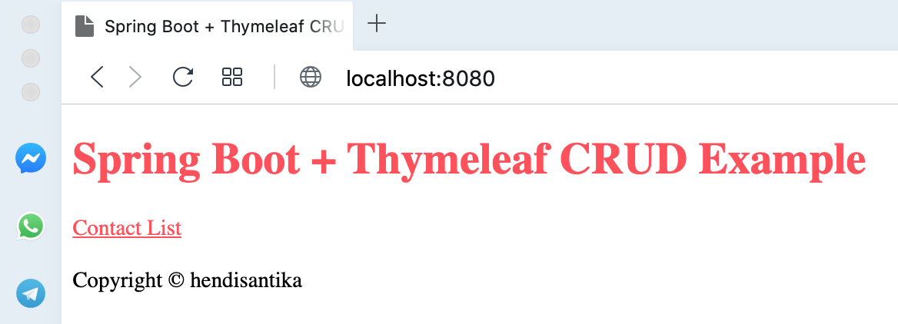
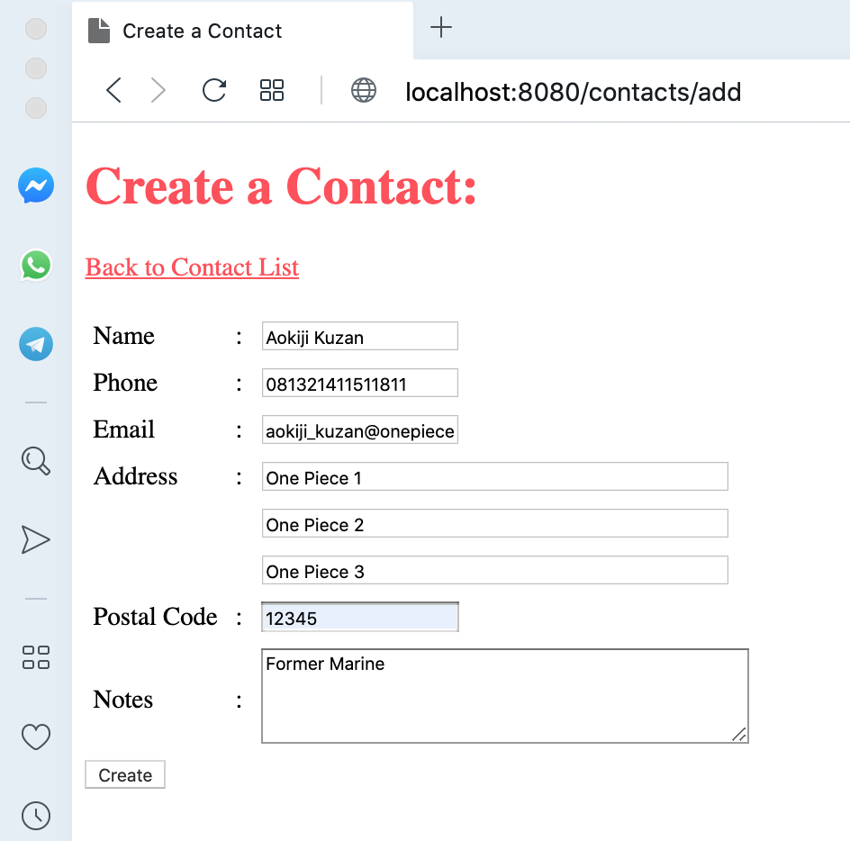
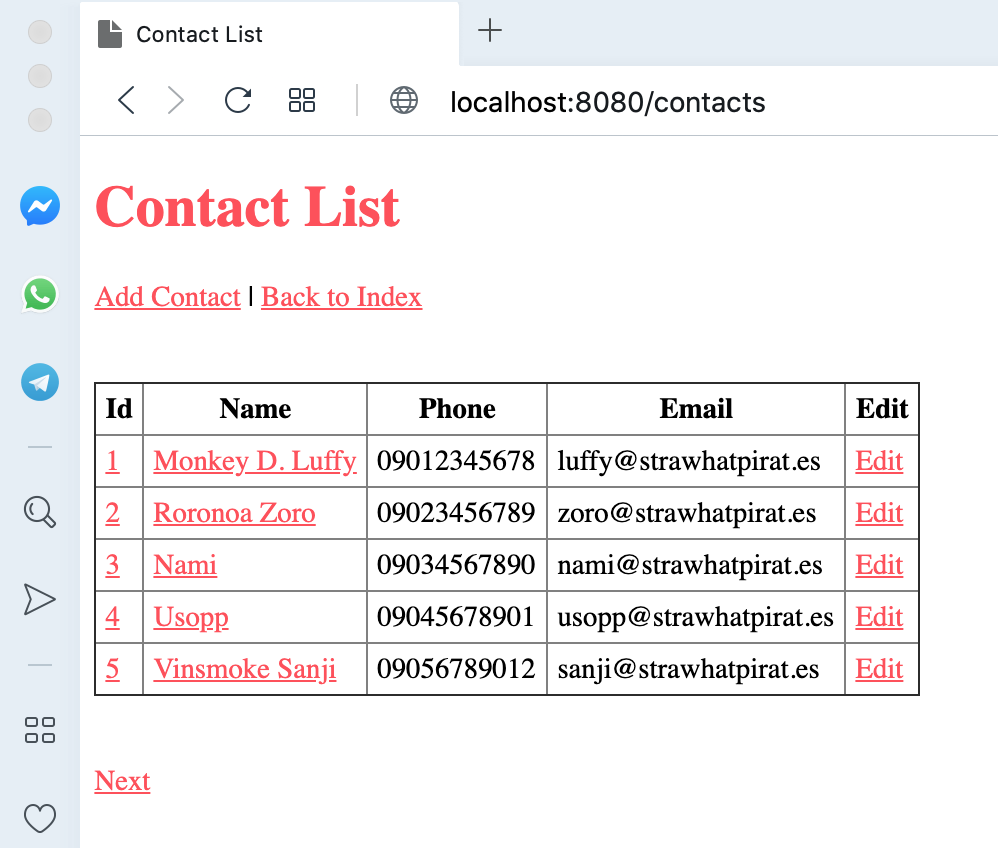
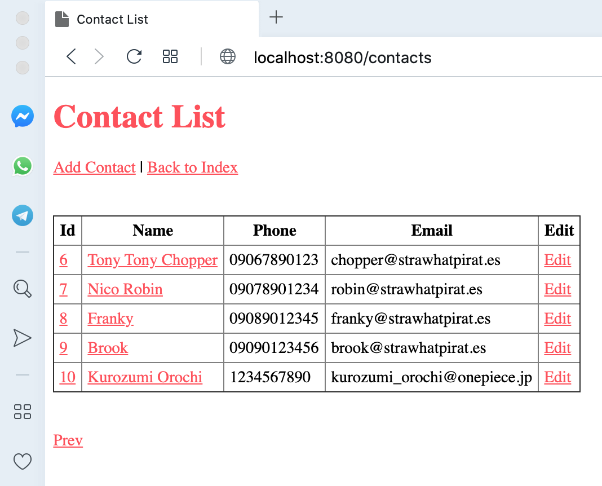
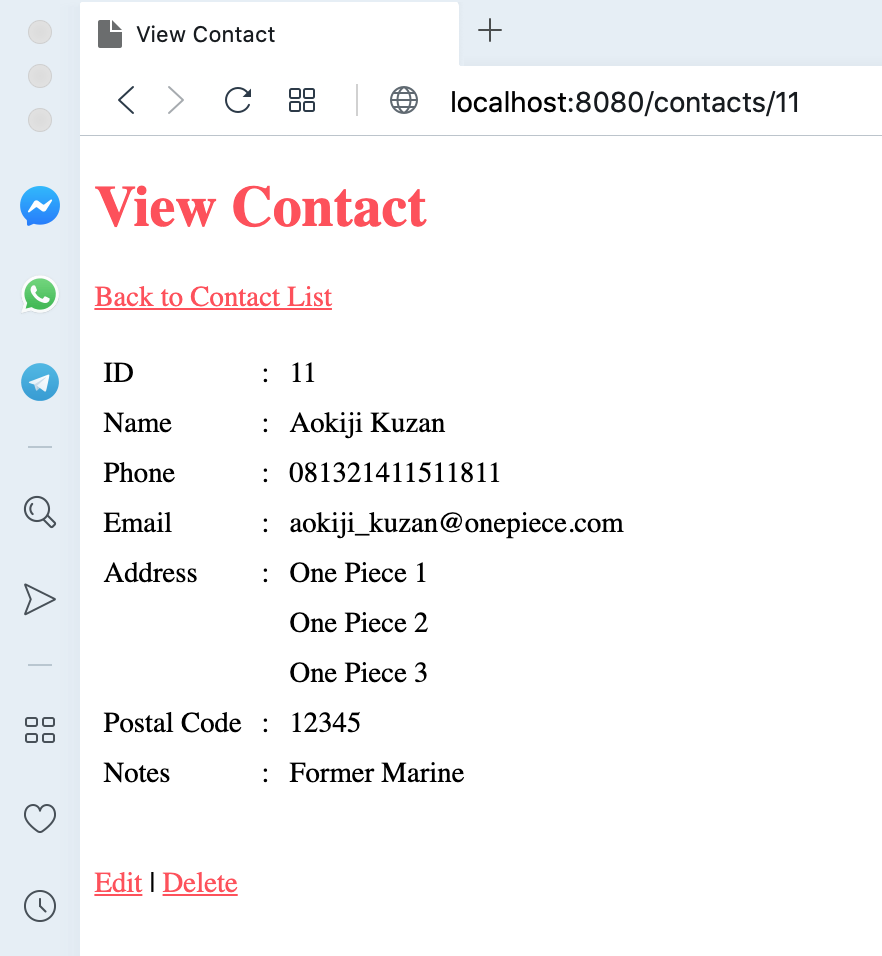
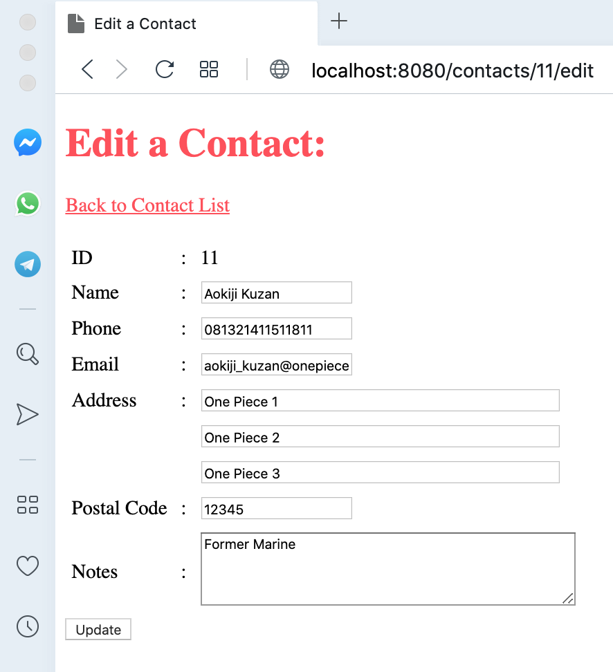
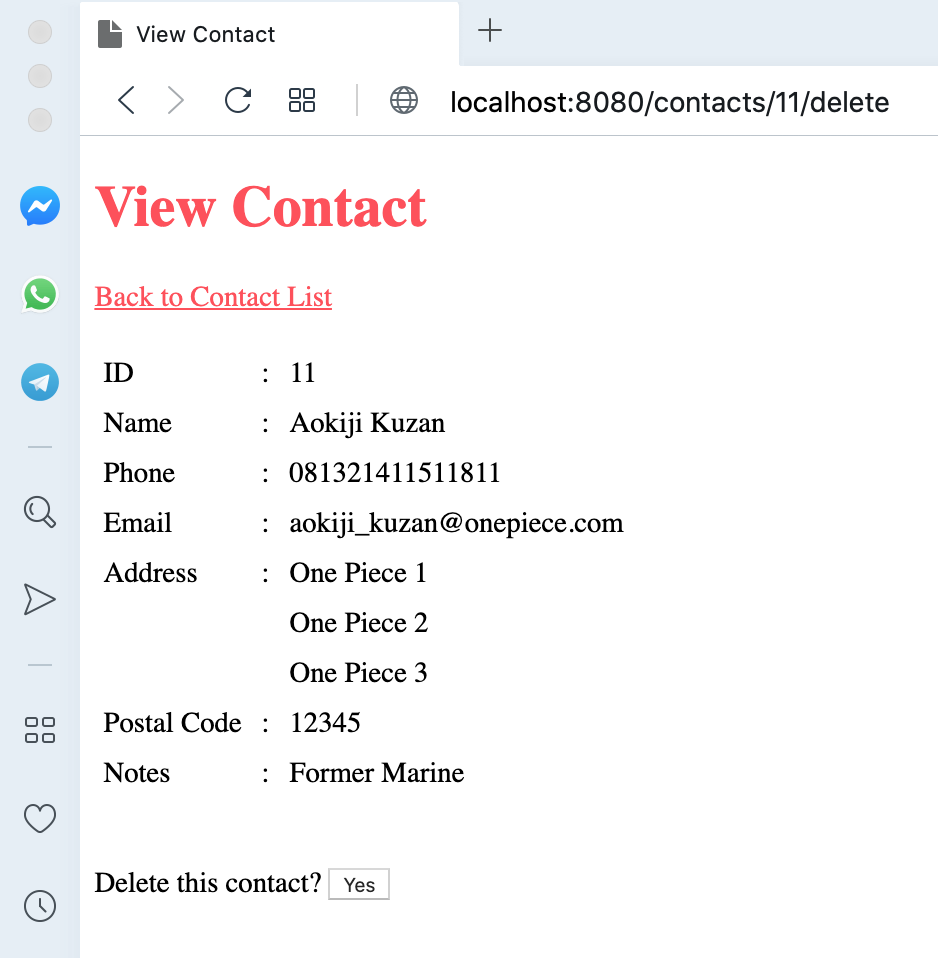

# springboot-thymeleaf-example

## Things to do:
1. Clone this repository: `git clone https://github.com/hendisantika/springboot-thymeleaf-example.git`
2. Go to the folder: `cd springboot-thymeleaf-example`
3. Run the application: `mvn clean spring-boot:run`
4. Open your favorite browser: http://localhost:8080

## Screen shot

**Index Page**

**Add New Contact**

**List Contact**

**View Contact**

**Edit Contact**

**Delete Contact**

